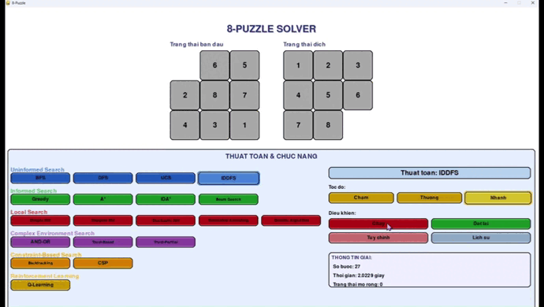
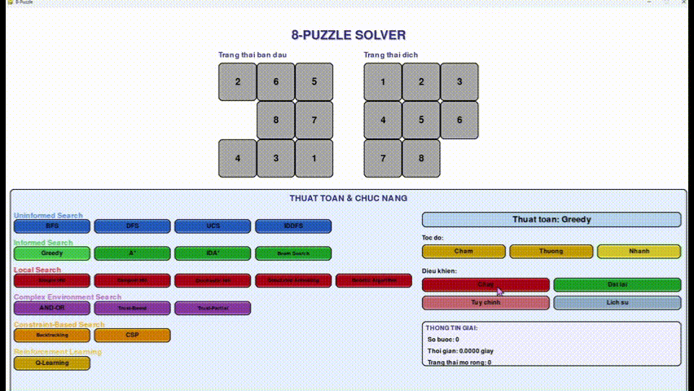
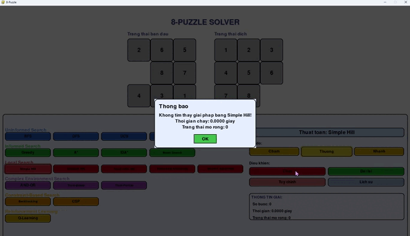
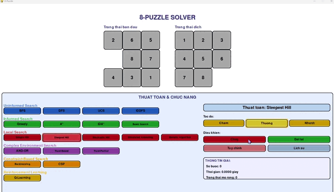
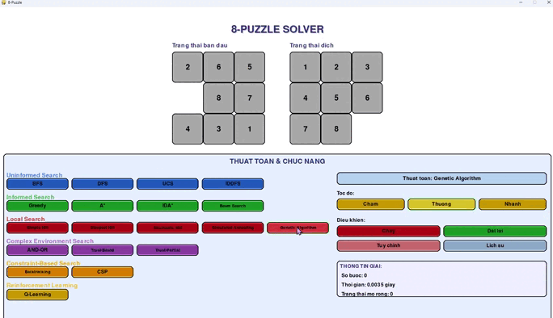
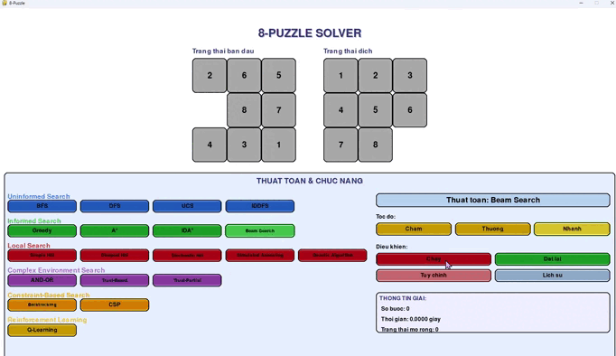
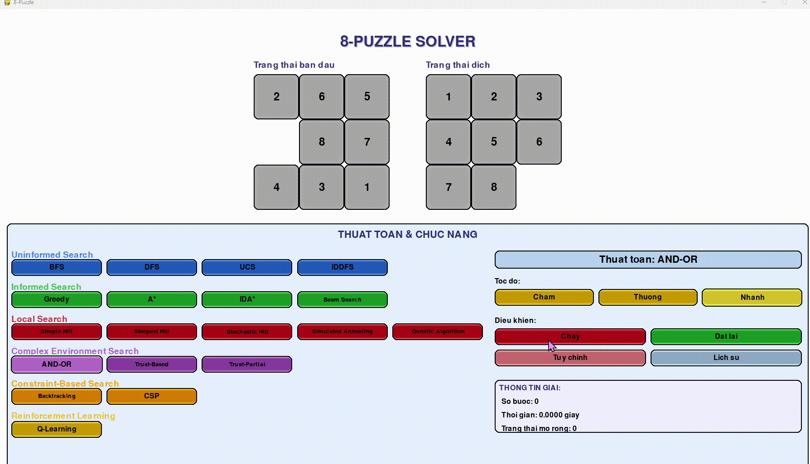
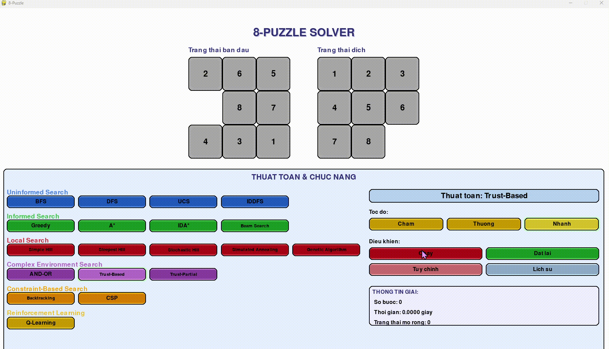
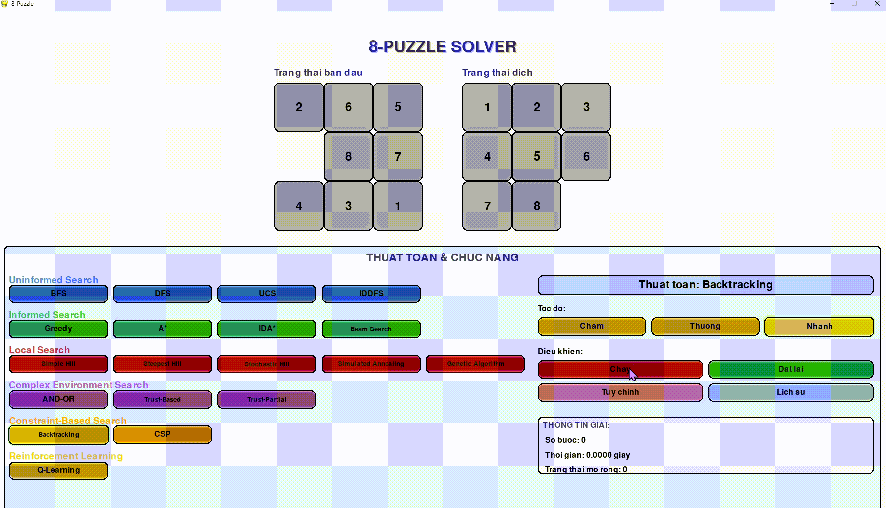
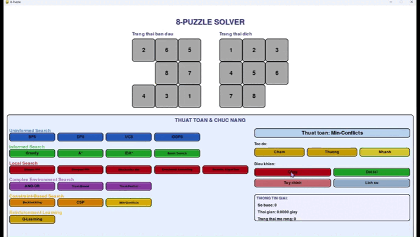

# Báo cáo đồ án cá nhân: Giải đố 8-Puzzle

## 1. Mục tiêu

Dự án này được xây dựng nhằm các mục tiêu chính sau:
* Phát triển một ứng dụng hoàn chỉnh có khả năng giải bài toán 8-puzzle (trò chơi xếp 8 ô số).
* Triển khai, thực thi và đánh giá một loạt các thuật toán tìm kiếm phổ biến trong lĩnh vực Trí tuệ Nhân tạo.
* Xây dựng giao diện đồ họa người dùng (GUI) trực quan, cho phép người dùng dễ dàng tương tác.
* So sánh hiệu suất của các thuật toán khác nhau để hiểu rõ hơn về ưu nhược điểm của chúng.
* Cung cấp một công cụ học tập và thực nghiệm hữu ích cho việc nghiên cứu các kỹ thuật giải quyết vấn đề trong AI.

## 2. Nội dung

### 2.1. Tổng quan về Bài toán Tìm kiếm và Giải pháp
Bài toán 8-puzzle, khi được tiếp cận bằng các thuật toán tìm kiếm, bao gồm các thành phần cơ bản sau:

* **Không gian trạng thái (State Space):** Là tập hợp tất cả các cấu hình (sắp xếp) có thể của 9 ô (8 ô số và 1 ô trống) trên lưới 3x3. Mỗi cấu hình là một trạng thái. Với 9 ô, có tổng cộng 9! = 362,880 hoán vị. Tuy nhiên, chỉ một nửa trong số này có thể giải được từ một trạng thái ban đầu cụ thể.
* **Trạng thái ban đầu (Initial State):** Là một cấu hình cụ thể của puzzle mà từ đó quá trình tìm kiếm bắt đầu. Ví dụ, trạng thái mặc định trong chương trình là `[[2, 6, 5], [0, 8, 7], [4, 3, 1]]`. Người dùng cũng có thể tùy chỉnh trạng thái này.
* **Trạng thái đích (Goal State):** Là cấu hình mong muốn mà thuật toán cần tìm cách đạt tới. Thông thường là các số được sắp xếp theo thứ tự từ 1 đến 8, với ô trống (số 0) ở vị trí cuối cùng:
    ```
    [[1, 2, 3],
     [4, 5, 6],
     [7, 8, 0]]
    ```
* **Hành động (Actions):** Tại mỗi trạng thái, các hành động có thể thực hiện là di chuyển ô trống sang một ô kề cận (lên, xuống, trái, hoặc phải), nếu nước đi đó hợp lệ (ô trống không di chuyển ra ngoài biên của lưới 3x3).
* **Hàm chuyển tiếp (Transition Model):** Mô tả trạng thái mới thu được sau khi thực hiện một hành động từ trạng thái hiện tại. Về cơ bản, đây là việc hoán đổi vị trí của ô trống với ô số mà nó di chuyển tới.
* **Chi phí đường đi (Path Cost):** Trong bài toán 8-puzzle cơ bản, chi phí của mỗi hành động (mỗi lần di chuyển ô trống) thường được tính là 1. Chi phí của một đường đi là tổng chi phí của các hành động trong đường đi đó, tương đương với số bước di chuyển.
* **Giải pháp (Solution):** Là một chuỗi các hành động (hoặc chuỗi các trạng thái tương ứng) dẫn từ trạng thái ban đầu đến trạng thái đích.
* **Giải pháp tối ưu (Optimal Solution):** Là giải pháp có chi phí đường đi nhỏ nhất. Đối với 8-puzzle với chi phí bước là 1, đây là giải pháp có số bước di chuyển ít nhất.


### 2.2. Các thuật toán Tìm kiếm không có thông tin (Uninformed Search)

#### 2.2.1. Các thuật toán triển khai trong nhóm
* Breadth-First Search (BFS) - Tìm kiếm theo chiều rộng
* Depth-First Search (DFS) - Tìm kiếm theo chiều sâu
* Uniform Cost Search (UCS) - Tìm kiếm chi phí thống nhất
* Iterative Deepening DFS (IDDFS) - Tìm kiếm lặp sâu dần

#### 2.2.2. Hình ảnh GIF minh họa hoạt động
* BFS
  


* UCS
  


* DFS
  


* IDFS
  


#### 2.2.3. Hình ảnh so sánh hiệu suất của các thuật toán


#### 2.2.4. Một vài nhận xét về hiệu suất
* **BFS:**
    * Luôn tìm ra giải pháp có số bước ít nhất (tối ưu về số bước) vì nó duyệt các nút theo từng mức độ sâu.
    * Đầy đủ (chắc chắn tìm thấy giải pháp nếu tồn tại).
    * Yêu cầu bộ nhớ lớn vì phải lưu trữ tất cả các nút ở biên (fringe). Không khả thi cho các bài toán có không gian trạng thái quá lớn hoặc lời giải ở rất sâu.
    * Thời gian thực thi tỷ lệ với số nút đã duyệt, có thể rất lớn.
* **DFS:**
    * Yêu cầu bộ nhớ ít hơn nhiều so với BFS (chỉ cần lưu trữ các nút trên một đường đi hiện tại).
    * Thường tìm ra giải pháp nhanh hơn BFS nếu giải pháp nằm trên một nhánh sâu và về phía "bên trái" của cây tìm kiếm.
    * Không đảm bảo tìm ra giải pháp tối ưu.
    * Có thể không đầy đủ nếu không gian trạng thái có chu trình hoặc nhánh vô hạn (trừ khi có kiểm tra lặp hoặc giới hạn độ sâu). Trong 8-puzzle, không gian trạng thái là hữu hạn.
* **UCS:**
    * Mở rộng các nút dựa trên chi phí đường đi từ trạng thái ban đầu (g(n)).
    * Đảm bảo tìm ra giải pháp có tổng chi phí thấp nhất (tối ưu về chi phí). Nếu chi phí mỗi bước là 1 (như trong 8-puzzle cơ bản), UCS hoạt động tương tự BFS.
    * Đầy đủ.
    * Tương tự BFS, có thể yêu cầu bộ nhớ và thời gian lớn.
* **IDDFS:**
    * Kết hợp ưu điểm của BFS (tính đầy đủ, tối ưu về số bước) và DFS (yêu cầu bộ nhớ thấp).
    * Thực hiện lặp lại DFS với giới hạn độ sâu tăng dần.
    * Mặc dù có sự lặp lại tính toán ở các mức độ sâu nông hơn, tổng chi phí thường không quá lớn so với BFS và lợi ích về bộ nhớ là đáng kể.
    * Là lựa chọn tốt khi cần giải pháp tối ưu về số bước và không gian bộ nhớ là một hạn chế.

### 2.3. Các thuật toán Tìm kiếm có thông tin (Informed Search / Heuristic Search)

#### 2.3.1. Cách tiếp cận bài toán và vai trò của Heuristic
Các thuật toán Tìm kiếm có thông tin vẫn dựa trên các thành phần cơ bản của bài toán tìm kiếm đã mô tả ở mục `2.2.1`. Tuy nhiên, điểm khác biệt và là sức mạnh chính của chúng nằm ở việc sử dụng **hàm heuristic (hàm ước lượng) $h(n)$**.

* **Hàm Heuristic $h(n)$:** Là một hàm ước lượng chi phí từ trạng thái hiện tại $n$ đến trạng thái đích gần nhất. Một heuristic tốt sẽ giúp hướng dẫn thuật toán tìm kiếm về phía mục tiêu một cách hiệu quả hơn, giảm thiểu số lượng trạng thái cần phải duyệt.
* Trong bài toán 8-puzzle, các hàm heuristic phổ biến bao gồm:
    * **Số ô sai vị trí (Number of Misplaced Tiles):** Đếm số ô (không tính ô trống) không nằm ở vị trí đúng so với trạng thái đích. Heuristic này 'admissible' (không đánh giá quá thực tế chi phí còn lại).
    * **Khoảng cách Manhattan (Manhattan Distance):** Tổng khoảng cách (theo chiều ngang và dọc) mà mỗi ô (không tính ô trống) cần di chuyển để về đúng vị trí của nó trong trạng thái đích. Heuristic này cũng 'admissible' và thường hiệu quả hơn 'số ô sai vị trí'.
    * **Xung đột tuyến tính (Linear Conflict):** (Được sử dụng trong code của bạn) Một cải tiến của khoảng cách Manhattan, cộng thêm 2 vào heuristic mỗi khi có hai ô nằm đúng hàng/cột của chúng trong trạng thái đích, nhưng vị trí tương đối của chúng bị ngược (ví dụ, ô A phải ở bên trái ô B trong hàng đích, nhưng hiện tại ô A lại ở bên phải ô B trong cùng hàng đó).

Việc sử dụng heuristic giúp các thuật toán này "thông minh" hơn trong việc lựa chọn hướng đi.

#### 2.3.2. Các thuật toán triển khai trong nhóm
* Greedy Search (Tìm kiếm tham lam) - Đánh giá nút chỉ dựa trên $h(n)$.
* A\* - Đánh giá nút dựa trên $f(n) = g(n) + h(n)$, với $g(n)$ là chi phí thực từ đầu đến $n$.
* Iterative Deepening A\* (IDA\*) - Phiên bản lặp sâu của A\*, sử dụng ngưỡng $f-cost$.

#### 2.3.3. Hình ảnh GIF minh họa hoạt động
* Greedy Search (Tìm kiếm tham lam)
  


* A\*
  


* Iterative Deepening A\* (IDA\*)
  


#### 2.3.4. Hình ảnh so sánh hiệu suất của các thuật toán


#### 2.3.5. Một vài nhận xét về hiệu suất
* **Greedy Search:**
    * Mở rộng nút có vẻ gần đích nhất theo heuristic $h(n)$.
    * Thường tìm ra giải pháp rất nhanh (nếu tìm được) nhưng không đảm bảo tối ưu.
    * Có thể bị "mắc kẹt" bởi các quyết định tham lam cục bộ dẫn đến đường đi dài hơn hoặc không tìm ra giải pháp.
    * Không đầy đủ (có thể đi vào vòng lặp nếu không kiểm tra trạng thái đã duyệt).
* **A\*:**
    * Cân bằng giữa chi phí đã đi $g(n)$ và chi phí ước lượng còn lại $h(n)$.
    * Đảm bảo tìm ra giải pháp tối ưu (có chi phí thấp nhất) nếu hàm heuristic $h(n)$ là 'admissible' (không bao giờ đánh giá quá cao chi phí thực tế đến đích). Nếu $h(n)$ còn 'consistent' (monotonic), A\* không cần phải mở lại các nút đã đóng.
    * Đầy đủ.
    * Thường hiệu quả hơn nhiều so với các thuật toán không thông tin và Greedy Search về mặt số trạng thái cần duyệt để tìm giải pháp tối ưu.
    * Nhược điểm chính là vẫn có thể yêu cầu lượng bộ nhớ lớn để lưu trữ danh sách các nút mở (open set/fringe), tương tự BFS/UCS trong trường hợp xấu nhất, mặc dù trong thực tế thường tốt hơn nhiều.
* **IDA\*:**
    * Là một biến thể của A\* sử dụng kỹ thuật tìm kiếm lặp sâu. Thay vì lưu trữ tất cả các nút ở biên, nó thực hiện một loạt các tìm kiếm giới hạn độ sâu, với ngưỡng cắt tỉa dựa trên giá trị $f(n) = g(n) + h(n)$.
    * Ưu điểm lớn nhất là yêu cầu bộ nhớ thấp, tương tự IDDFS.
    * Đảm bảo tìm ra giải pháp tối ưu nếu $h(n)$ là admissible.
    * Nhược điểm là có thể duyệt lại các trạng thái nhiều lần, đặc biệt nếu có nhiều giá trị $f-cost$ khác nhau gần giá trị tối ưu.

### 2.4. Các thuật toán Tìm kiếm cục bộ (Local Search)

#### 2.4.1. Cách tiếp cận bài toán
Các thuật toán tìm kiếm cục bộ hoạt động theo một cách khác biệt so với các thuật toán tìm kiếm có hệ thống (systematic search) như BFS hay A\*. Thay vì xây dựng và khám phá một cây tìm kiếm các đường đi từ trạng thái ban đầu, chúng thường:

* Bắt đầu với một trạng thái hiện tại (có thể là trạng thái ban đầu hoặc một trạng thái ngẫu nhiên).
* Lặp đi lặp lại việc di chuyển đến một trạng thái "láng giềng" của trạng thái hiện tại.
* Quyết định di chuyển dựa trên một hàm đánh giá (thường là hàm mục tiêu hoặc heuristic) của các trạng thái láng giềng so với trạng thái hiện tại.
* Mục tiêu là tìm một trạng thái là "tối ưu cục bộ" (local optimum) hoặc, hy vọng là "tối ưu toàn cục" (global optimum).
* Các thuật toán này thường không lưu trữ đường đi mà chỉ quan tâm đến trạng thái hiện tại và các trạng thái láng giềng của nó.
* Giải pháp (solution) trong tìm kiếm cục bộ thường là trạng thái cuối cùng mà thuật toán dừng lại, hy vọng đó là trạng thái đích hoặc một trạng thái rất gần với trạng thái đích.

Đối với 8-puzzle, hàm đánh giá có thể là giá trị âm của heuristic ( ví dụ: $h(n)$ ), và mục tiêu là tối đa hóa giá trị này (tương đương tối thiểu hóa $h(n)$ ).

#### 2.4.2. Các thuật toán triển khai trong nhóm
* Hill Climbing (Leo đồi):
    * Simple Hill Climbing (Leo đồi đơn giản)
    * Steepest-Ascent Hill Climbing (Leo đồi dốc nhất)
    * Stochastic Hill Climbing (Leo đồi ngẫu nhiên)
* Simulated Annealing (Luyện mô phỏng / Ủ tôi)
* Genetic Algorithms (Thuật toán di truyền)
* Beam Search (Tìm kiếm chùm tia)

#### 2.4.3. Hình ảnh GIF minh họa hoạt động
* Simple Hill Climbing (Leo đồi đơn giản)
  


* Steepest-Ascent Hill Climbing (Leo đồi dốc nhất)
  


* Stochastic Hill Climbing (Leo đồi ngẫu nhiên)
  


* Simulated Annealing (Luyện mô phỏng / Ủ tôi)
  


* Genetic Algorithms (Thuật toán di truyền)
  


* Beam Search (Tìm kiếm chùm tia)
  


#### 2.4.4. Hình ảnh so sánh hiệu suất của các thuật toán


#### 2.4.5. Một vài nhận xét về hiệu suất
* **Hill Climbing (các biến thể):**
    * Ưu điểm: Đơn giản để triển khai, yêu cầu ít bộ nhớ (chỉ lưu trạng thái hiện tại).
    * Nhược điểm: Dễ bị mắc kẹt ở các cực đại cục bộ (local optima - trạng thái tốt hơn tất cả láng giềng nhưng không phải tốt nhất toàn cục), các vùng bằng phẳng (plateaus - các láng giềng có cùng giá trị đánh giá), hoặc các đỉnh núi giả (ridges).
        * *Simple Hill Climbing:* Chọn láng giềng tốt hơn đầu tiên tìm thấy.
        * *Steepest-Ascent Hill Climbing:* Đánh giá tất cả láng giềng và chọn cái tốt nhất. Tốn nhiều thời gian đánh giá hơn nhưng có thể leo dốc hơn.
        * *Stochastic Hill Climbing:* Chọn một láng giềng tốt hơn một cách ngẫu nhiên, giúp có cơ hội thoát khỏi một số loại cực đại cục bộ.
* **Simulated Annealing:**
    * Lấy cảm hứng từ quá trình ủ kim loại.
    * Có khả năng thoát khỏi các cực đại cục bộ bằng cách cho phép các bước đi "xấu hơn" (giảm giá trị hàm mục tiêu) với một xác suất nhất định. Xác suất này giảm dần theo "nhiệt độ" (một tham số điều khiển giảm dần theo thời gian).
    * Nếu lịch trình làm nguội (cooling schedule) đủ chậm, có thể hội tụ về tối ưu toàn cục.
    * Nhược điểm: Cần phải lựa chọn lịch trình làm nguội và các tham số khác một cách cẩn thận.
* **Genetic Algorithms:**
    * Mô phỏng quá trình tiến hóa tự nhiên. Duy trì một "quần thể" các trạng thái (cá thể).
    * Sử dụng các toán tử như lựa chọn (selection), lai ghép (crossover), và đột biến (mutation) để tạo ra các thế hệ mới.
    * Ưu điểm: Có khả năng khám phá song song nhiều vùng của không gian tìm kiếm, mạnh mẽ trong việc tìm kiếm giải pháp gần tối ưu cho các bài toán phức tạp.
    * Nhược điểm: Yêu cầu nhiều tài nguyên tính toán (thời gian và bộ nhớ để quản lý quần thể). Cần tinh chỉnh nhiều tham số. Không đảm bảo tìm ra giải pháp tối ưu. Trong 8-puzzle, việc định nghĩa phép lai ghép và đột biến hợp lệ có thể phức tạp.
* **Beam Search:**
    * Là một biến thể của tìm kiếm theo chiều rộng nhưng giới hạn số lượng trạng thái "hứa hẹn nhất" (dựa trên heuristic) được giữ lại ở mỗi bước (gọi là `beam_width` - $k$).
    * Ưu điểm: Tiết kiệm bộ nhớ hơn BFS và A\* đáng kể nếu $k$ nhỏ.
    * Nhược điểm: Không đầy đủ (có thể bỏ lỡ giải pháp nếu nó không nằm trong $k$ trạng thái tốt nhất ở một bước nào đó) và không tối ưu. Chất lượng giải pháp phụ thuộc vào $k$ và chất lượng của heuristic.

### 2.5. Các thuật toán Tìm kiếm trong môi trường phức tạp

#### 2.5.1. Đặc điểm bài toán và cách tiếp cận
Nhóm này bao gồm các thuật toán được thiết kế để giải quyết các bài toán mà việc xác định nước đi hoặc kết quả của nước đi không hoàn toàn rõ ràng, hoặc môi trường chỉ có thể quan sát được một phần, hoặc bài toán có cấu trúc phân cấp. Các thành phần cơ bản của bài toán tìm kiếm (mục `2.2.1`) vẫn áp dụng, nhưng cách các thuật toán này tương tác hoặc diễn giải chúng có thể khác:

* **AND-OR Search:** Phù hợp cho các bài toán có thể được phân rã thành các bài toán con (AND nodes - tất cả các bài toán con phải được giải quyết) hoặc có các lựa chọn thay thế (OR nodes - chỉ cần một trong các lựa chọn được giải quyết). Giải pháp là một cây con của đồ thị AND-OR.
* **Partially Observable Environments (ví dụ: Trust-Based Partial Search):** Trong các môi trường này, tác nhân không thể quan sát toàn bộ trạng thái hiện tại. Nó phải duy trì một "belief state" (trạng thái niềm tin) - một tập hợp các trạng thái có thể mà nó đang ở trong đó. Hành động được chọn dựa trên belief state này. `Trust-Based Partial Search` trong code của bạn dường như tập trung giải quyết các mục tiêu con (ví dụ: từng hàng của puzzle), coi như mỗi mục tiêu con là một phần của bài toán lớn có thể quan sát và giải quyết độc lập ở một mức độ nào đó.
* **Unknown or Dynamic Environments (ví dụ: Trust-Based Search):** Môi trường có thể không được biết trước hoàn toàn hoặc có thể thay đổi. `Trust-Based Search` có thể sử dụng một "điểm tin cậy" để điều chỉnh heuristic hoặc chiến lược tìm kiếm dựa trên kinh nghiệm hoặc thông tin thu thập được.

#### 2.5.2. Các thuật toán triển khai trong nhóm
* AND-OR Search (Tìm kiếm trên cây AND-OR)
* Trust-Based Search (Tìm kiếm dựa trên niềm tin)
* Trust-Based Partial Search (Tìm kiếm dựa trên niềm tin, tập trung vào mục tiêu con)

#### 2.5.3. Hình ảnh GIF minh họa hoạt động
* AND-OR Search (Tìm kiếm trên cây AND-OR)
  


* Trust-Based Search (Tìm kiếm dựa trên niềm tin)
  


* Trust-Based Partial Search (Tìm kiếm dựa trên niềm tin, tập trung vào mục tiêu con)
  


#### 2.5.4. Hình ảnh so sánh hiệu suất của các thuật toán


#### 2.5.5. Một vài nhận xét về hiệu suất
* **AND-OR Search:**
    * Trong code của bạn, `and_or_search` có vẻ như một dạng tìm kiếm đệ quy có giới hạn độ sâu và sử dụng memoization. Việc nó có thực sự mô hình hóa 8-puzzle thành cấu trúc AND-OR điển hình hay không cần xem xét kỹ hơn. Nếu áp dụng đúng, nó hiệu quả cho các bài toán có cấu trúc phân rã tự nhiên.
* **Trust-Based Search:**
    * Thuật toán này sử dụng một "điểm tin cậy" kết hợp với heuristic (Manhattan + Linear Conflict) để hướng dẫn tìm kiếm. Ý tưởng là điều chỉnh sự phụ thuộc vào heuristic dựa trên "kinh nghiệm" (ví dụ, khoảng cách trung bình đến các trạng thái đã thăm gần đây).
    * Hiệu suất phụ thuộc vào cách điểm tin cậy được tính toán và ảnh hưởng đến việc lựa chọn nút. Có thể giúp thoát khỏi các vùng heuristic "lừa dối".
* **Trust-Based Partial Search:**
    * Cách tiếp cận này rất thú vị cho 8-puzzle bằng cách chia bài toán thành các mục tiêu con (hoàn thành hàng 1, rồi hàng 2, v.v.).
    * Nó sử dụng một heuristic cục bộ cho từng hàng mục tiêu và một cơ chế "niềm tin" để ưu tiên các bước đi.
    * Ưu điểm: Có thể đơn giản hóa bài toán, tìm ra giải pháp một cách có cấu trúc. Giao diện người dùng trong code của bạn có vẻ trực quan hóa quá trình này.
    * Nhược điểm: Việc giải quyết tối ưu một mục tiêu con có thể không dẫn đến giải pháp tối ưu cho toàn bộ bài toán. Có thể cần các bước "sửa chữa" phức tạp nếu việc hoàn thành một hàng làm xáo trộn các hàng đã hoàn thành trước đó.

### 2.6. Các thuật toán Tìm kiếm trong môi trường có ràng buộc (Constraint Satisfaction Problems - CSPs)

#### 2.6.1. Mô hình hóa 8-Puzzle như một CSP và cách tiếp cận của các thuật toán
Bài toán 8-puzzle có thể được tiếp cận từ góc độ thỏa mãn ràng buộc, mặc dù các thuật toán tìm đường đi truyền thống phổ biến hơn.

* **Cách tiếp cận CSP truyền thống (không phải là trọng tâm chính của các hàm trong code cho 8-puzzle):**
    * **Biến (Variables):** 9 biến $X_i$ cho mỗi ô trên lưới.
    * **Miền giá trị (Domains):** $\{0, 1, ..., 8\}$ cho mỗi biến.
    * **Ràng buộc (Constraints):** Tất cả các biến phải khác nhau (AllDifferent), và các biến phải có giá trị tương ứng với trạng thái đích.
    * **Giải pháp:** Một phép gán giá trị cho các biến thỏa mãn tất cả ràng buộc.

* **Cách tiếp cận trong code dự án này:** Các thuật toán trong nhóm này được điều chỉnh để tìm một *đường đi* (chuỗi các trạng thái/nước đi) từ trạng thái ban đầu đến trạng thái đích, đồng thời có thể xem xét các ràng buộc trên đường đi đó hoặc trong quá trình tìm kiếm.
    * **Backtracking Search:** Tìm kiếm một chuỗi các nước đi hợp lệ.
    * **Constraint Satisfaction (`constraint_satisfaction` function):** Sử dụng các kỹ thuật như mô phỏng AC-3 và heuristic MRV để hướng dẫn việc chọn nước đi trong quá trình tìm kiếm đường đi.
    * **Min-Conflicts (`min_conflicts` function):** Đây là một thuật toán tìm kiếm cục bộ, thường dùng cho CSP. Trong bối cảnh này, nó được sử dụng để "sửa chữa" một *đường đi hiện có* (ví dụ, một đường đi tìm được bởi A*).
        * **"Biến" có thể được coi là:** Các trạng thái tại mỗi vị trí (index) trong đường đi.
        * **"Giá trị" cho biến này là:** Các trạng thái 8-puzzle lân cận có thể thay thế cho trạng thái hiện tại ở vị trí đó trong đường đi.
        * **"Xung đột" (Conflicts) cần giảm thiểu bao gồm:**
            1.  Vi phạm ràng buộc tùy chỉnh `check_2_5_adjacency(state)`: yêu cầu ô số 2 và ô số 5 phải kề nhau trong mỗi trạng thái của đường đi.
            2.  Các bước chuyển không hợp lệ giữa các trạng thái liên tiếp trong đường đi (ví dụ: trạng thái $S_{i+1}$ không phải là láng giềng của $S_i$).
            3.  Đường đi không kết thúc ở trạng thái đích.
        * Thuật toán chọn ngẫu nhiên một trạng thái "xung đột" trong đường đi và cố gắng thay thế nó bằng một trạng thái lân cận (trong không gian các trạng thái 8-puzzle) sao cho tổng số xung đột trên toàn bộ đường đi được giảm thiểu.

#### 2.6.2. Các thuật toán/kỹ thuật triển khai trong nhóm
* Backtracking Search (tìm đường đi có ràng buộc ngầm về tính hợp lệ của nước đi)
* CSP (hàm `constraint_satisfaction` sử dụng kỹ thuật giống AC-3 và MRV để tìm đường đi)
* Min-Conflicts (sửa chữa đường đi có sẵn để thỏa mãn các ràng buộc đường đi và ràng buộc tùy chỉnh `check_2_5_adjacency`)

#### 2.6.3. Hình ảnh GIF minh họa hoạt động
* Backtracking Search (Tìm kiếm quay lui)
  


* CSP (sử dụng AC-3 và MRV)
  


* Min-Conflicts (sửa chữa đường đi)


  
#### 2.6.4. Hình ảnh so sánh hiệu suất của các thuật toán


* #### 2.6.5. Một vài nhận xét về hiệu suất
* **Backtracking Search (tìm đường đi):**
    * Hàm `backtracking_search` trong code là một thuật toán tìm kiếm sâu có hệ thống, thử các nước đi và quay lui.
    * Việc sử dụng heuristic (Manhattan distance) để sắp xếp thứ tự thử các nước đi (`ORDER-DOMAIN-VALUES`) giúp cải thiện hiệu suất.
    * Hiệu quả phụ thuộc vào chất lượng heuristic và giới hạn độ sâu.
* **`constraint_satisfaction` với AC-3 và MRV:**
    * Hàm này sử dụng các kỹ thuật CSP để hướng dẫn tìm kiếm đường đi. AC-3 (mô phỏng) có thể dùng để kiểm tra tính nhất quán cục bộ, và MRV giúp chọn nước đi "khó khăn" nhất hoặc hứa hẹn nhất.
    * Là một dạng tìm kiếm có hướng dẫn heuristic, có thể kết hợp A\* khi gần bế tắc.
* **Min-Conflicts (sửa đường đi):**
    * Hoạt động như một thuật toán tìm kiếm cục bộ hiệu quả để tối ưu hóa một giải pháp hiện có bằng cách giảm thiểu số lượng vi phạm ràng buộc.
    * Trong ngữ cảnh sửa đường đi 8-puzzle:
        * Bắt đầu với một đường đi ban đầu (ví dụ, từ A*).
        * Hiệu quả phụ thuộc mạnh vào chất lượng của đường đi ban đầu này. Nếu đường đi ban đầu quá xa giải pháp tốt hoặc có quá nhiều xung đột khó giải quyết, Min-Conflicts có thể không thành công hoặc mất nhiều thời gian.
        * Ràng buộc tùy chỉnh `check_2_5_adjacency` là một yếu tố làm tăng độ phức tạp và có thể khiến việc tìm một đường đi hoàn toàn không xung đột trở nên khó khăn hơn.
        * Việc chọn ngẫu nhiên biến xung đột để sửa giúp thuật toán có khả năng thoát khỏi một số điểm tối ưu cục bộ.
        * Thích hợp cho việc "tinh chỉnh" một giải pháp gần đúng hoặc một giải pháp đã có nhưng vi phạm một số ràng buộc cụ thể, hơn là tìm giải pháp từ đầu trong không gian đường đi phức tạp.

### 2.7. Học tăng cường (Reinforcement Learning)

#### 2.7.1. 8-Puzzle dưới góc độ Học tăng cường
Trong cách tiếp cận Học tăng cường (RL), bài toán 8-puzzle được xem xét từ góc độ một **tác nhân (agent)** (người giải puzzle) tương tác với một **môi trường (environment)** (trò chơi 8-puzzle). Các thành phần chính bao gồm:

* **Trạng thái (State $S$):** Mỗi cấu hình của 8-puzzle là một trạng thái.
* **Hành động (Action $A$):** Các nước đi hợp lệ của ô trống (lên, xuống, trái, phải).
* **Hàm chuyển tiếp (Transition $P(S'|S,A)$):** Xác suất chuyển từ trạng thái $S$ sang trạng thái $S'$ khi thực hiện hành động $A$. Trong 8-puzzle, hàm chuyển tiếp là tất định (deterministic).
* **Phần thưởng (Reward):** Tác nhân nhận được phần thưởng sau mỗi hành động. Ví dụ:
    * Một phần thưởng lớn (ví dụ: +100) khi đạt trạng thái đích.
    * Một phần thưởng nhỏ, dương (ví dụ: +1) cho mỗi bước đi làm giảm khoảng cách đến đích (theo heuristic).
    * Một hình phạt nhỏ (ví dụ: -0.01 hoặc -1) cho mỗi bước đi không tiến gần hơn hoặc đi vào trạng thái đã thăm.
* **Chính sách (Policy):** Là chiến lược của tác nhân, xác định hành động nào sẽ được chọn ở mỗi trạng thái. Mục tiêu của RL là học được một chính sách tối ưu $\pi^*$ để tối đa hóa tổng phần thưởng kỳ vọng tích lũy theo thời gian.
* **Giải pháp (Solution):** Trong RL, giải pháp là chính sách tối ưu . Sau khi học được chính sách này, tác nhân có thể sử dụng nó để tìm đường đi từ trạng thái ban đầu đến trạng thái đích một cách hiệu quả.

#### 2.7.2. Thuật toán triển khai trong nhóm
* Q-Learning

#### 2.7.3. Hình ảnh GIF minh họa hoạt động
* Q-Learning
  


#### 2.7.4. Hình ảnh so sánh hiệu suất của các thuật toán


#### 2.7.5. Một vài nhận xét về hiệu suất
* **Q-Learning:**
    * Là một thuật toán học tăng cường không dựa trên mô hình (model-free), off-policy. Nó học một hàm giá trị hành động (Q-value, $Q(S,A)$ ) để ước lượng "chất lượng" (tổng phần thưởng kỳ vọng trong tương lai) của việc thực hiện hành động $A$ trong trạng thái $S$ và sau đó tuân theo chính sách tối ưu.
    * **Giai đoạn huấn luyện:**
        * Yêu cầu nhiều episodes (lượt chơi thử) để khám phá không gian trạng thái-hành động và cập nhật bảng Q.
        * Sử dụng chiến lược khám phá (ví dụ: epsilon-greedy - với xác suất epsilon thì chọn hành động ngẫu nhiên, còn lại thì chọn hành động tốt nhất theo bảng Q hiện tại) để cân bằng giữa việc khám phá (exploration) và khai thác (exploitation). Epsilon thường giảm dần theo thời gian.
        * Các tham số như tỷ lệ học (learning rate $\alpha$ ), yếu tố chiết khấu (discount factor $\gamma$ ), và lịch trình epsilon ảnh hưởng lớn đến tốc độ hội tụ và chất lượng của bảng Q học được.
        * Đối với 8-puzzle, không gian trạng thái là khá lớn (362,880 trạng thái), nên việc huấn luyện một bảng Q đầy đủ có thể tốn thời gian và bộ nhớ.
    * **Giai đoạn thực thi (sau khi học):**
        * Khi bảng Q đã hội tụ, việc tìm đường đi tối ưu (theo những gì đã học) từ một trạng thái ban đầu rất nhanh: chỉ cần ở mỗi trạng thái, chọn hành động có giá trị Q cao nhất.
    * Ưu điểm: Có thể học được chính sách tối ưu mà không cần biết trước mô hình của môi trường. Linh hoạt.
    * Nhược điểm: Thời gian huấn luyện dài, yêu cầu bộ nhớ cho bảng Q. "Lời nguyền chiều không gian" (curse of dimensionality) có thể là vấn đề với các bài toán có không gian trạng thái lớn hơn nhiều.
    * Trong code của bạn, việc kết hợp với A\* nếu Q-Learning không tìm ra giải pháp hoàn chỉnh là một cách tiếp cận thực tế.

## 3. Kết luận

Dự án này đã thành công trong việc xây dựng một ứng dụng giải đố 8-puzzle toàn diện, tích hợp một loạt các thuật toán tìm kiếm đa dạng từ nhiều lĩnh vực của Trí tuệ Nhân tạo. Các kết quả đạt được bao gồm:

* **Triển khai thành công nhiều thuật toán:** Từ các thuật toán tìm kiếm cơ bản như BFS, DFS đến các thuật toán nâng cao hơn như A\*, IDA\*, Simulated Annealing, Genetic Algorithms, Q-Learning và các phương pháp tiếp cận CSP, AND-OR search, Trust-Based search.
* **Xây dựng giao diện người dùng trực quan:** Giao diện Pygame cho phép người dùng dễ dàng lựa chọn thuật toán, tùy chỉnh trạng thái ban đầu, điều chỉnh tốc độ mô phỏng và quan sát quá trình giải quyết bài toán. Chức năng hiển thị lịch sử và thông báo giúp người dùng theo dõi tốt hơn.
* **Khả năng so sánh và đánh giá thuật toán:** Cung cấp các thông số như số bước, thời gian thực thi, số trạng thái mở rộng, tạo điều kiện cho việc phân tích và so sánh hiệu quả của các phương pháp khác nhau trên cùng một bài toán.
* **Nền tảng học tập và nghiên cứu:** Dự án này có thể được sử dụng như một công cụ giáo dục để minh họa cách các thuật toán tìm kiếm hoạt động, cũng như một cơ sở để phát triển và thử nghiệm các ý tưởng thuật toán mới.
* **Hiểu biết sâu sắc hơn về AI:** Quá trình thực hiện dự án giúp củng cố kiến thức về các khái niệm cốt lõi trong AI như không gian trạng thái, hàm heuristic, tìm kiếm cục bộ, bài toán thỏa mãn ràng buộc và học tăng cường.

Nhìn chung, dự án không chỉ giải quyết được bài toán 8-puzzle mà còn cung cấp một môi trường phong phú để khám phá và ứng dụng các kỹ thuật Trí tuệ Nhân tạo.

---

**Cách sử dụng (Hướng dẫn cơ bản):**
1.  Đảm bảo bạn đã cài đặt Python và các thư viện cần thiết: `pygame`, `tkinter`.
2.  Sử dụng giao diện để:
    * Chọn một thuật toán từ danh sách.
    * Chọn tốc độ mô phỏng (Chậm, Thường, Nhanh).
    * Nhấn nút "Chạy" để bắt đầu giải.
    * Sử dụng "Đặt lại" để quay về trạng thái ban đầu mặc định.
    * Sử dụng "Tùy chỉnh" để nhập trạng thái ban đầu của riêng bạn.
    * Sử dụng "Lịch sử" để xem lại các bước đã đi.

